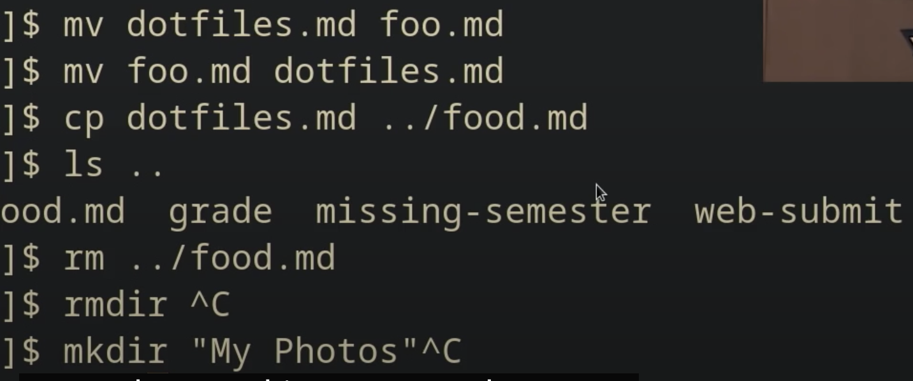
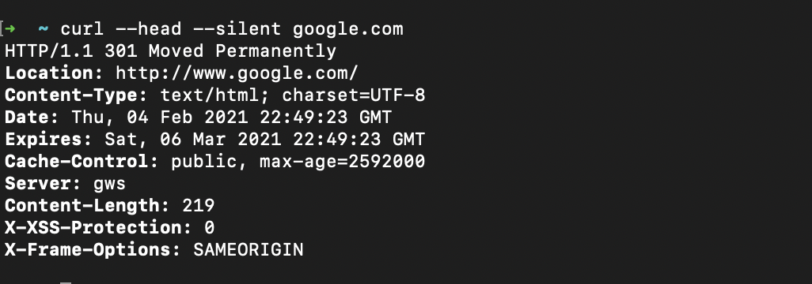
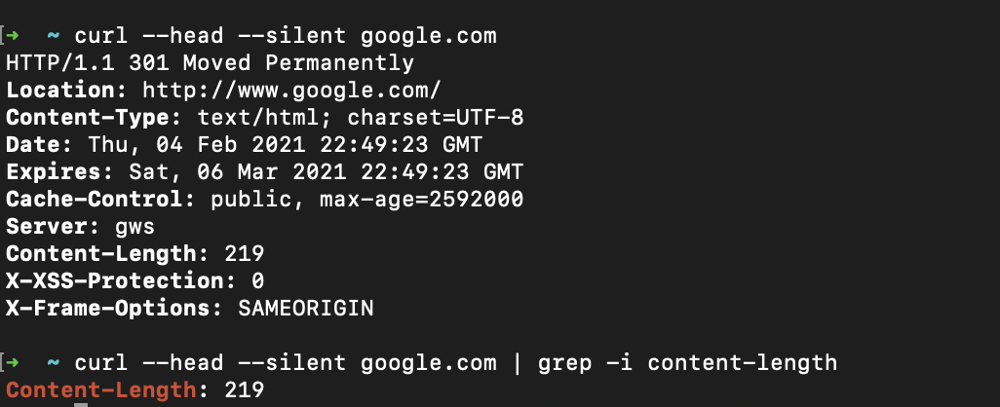

# L1. Shell

## Basic

[6:04](https://www.youtube.com/watch?v=Z56Jmr9Z34Q&t=364s) shall prompt [6:32](https://www.youtube.com/watch?v=Z56Jmr9Z34Q&t=392s) curstermizing shall [7:03](https://www.youtube.com/watch?v=Z56Jmr9Z34Q&t=423s) $date [7:19](https://www.youtube.com/watch?v=Z56Jmr9Z34Q&t=439s) $echo [7:29](https://www.youtube.com/watch?v=Z56Jmr9Z34Q&t=449s) $echo hello [7:46](https://www.youtube.com/watch?v=Z56Jmr9Z34Q&t=466s) $echo "Hello world" [8:41](https://www.youtube.com/watch?v=Z56Jmr9Z34Q&t=521s) [10:01](https://www.youtube.com/watch?v=Z56Jmr9Z34Q&t=601s) environment variable [10:17](https://www.youtube.com/watch?v=Z56Jmr9Z34Q&t=617s) $echo $PATH [11:01](https://www.youtube.com/watch?v=Z56Jmr9Z34Q&t=661s) $ which echo [12:30](https://www.youtube.com/watch?v=Z56Jmr9Z34Q&t=750s) relative path [12:50](https://www.youtube.com/watch?v=Z56Jmr9Z34Q&t=770s) $pwd \(print working directory\) [13:24](https://www.youtube.com/watch?v=Z56Jmr9Z34Q&t=804s) cd /home \(change my directory\) [13:58](https://www.youtube.com/watch?v=Z56Jmr9Z34Q&t=838s) dot [15:03](https://www.youtube.com/watch?v=Z56Jmr9Z34Q&t=903s) ../../../../../ [16:20](https://www.youtube.com/watch?v=Z56Jmr9Z34Q&t=980s) $ls [17:15](https://www.youtube.com/watch?v=Z56Jmr9Z34Q&t=1035s) ~ tild [17:36](https://www.youtube.com/watch?v=Z56Jmr9Z34Q&t=1056s) - dash $ cd - [20:09](https://www.youtube.com/watch?v=Z56Jmr9Z34Q&t=1209s) d means directory [21:32](https://www.youtube.com/watch?v=Z56Jmr9Z34Q&t=1292s) read, write, execute [24:32](https://www.youtube.com/watch?v=Z56Jmr9Z34Q&t=1472s) mv \(rename, move\) [25:20](https://www.youtube.com/watch?v=Z56Jmr9Z34Q&t=1520s) cp \(copy from, to\) [25:50](https://www.youtube.com/watch?v=Z56Jmr9Z34Q&t=1550s) rm \(remove\) [26:15](https://www.youtube.com/watch?v=Z56Jmr9Z34Q&t=1575s) rmdir, mkdir \(remove directory, make directory\) [26:50](https://www.youtube.com/watch?v=Z56Jmr9Z34Q&t=1610s) man \(manual\) [27:55](https://www.youtube.com/watch?v=Z56Jmr9Z34Q&t=1675s) Ctrl+L \(clear shall\) [28:30](https://www.youtube.com/watch?v=Z56Jmr9Z34Q&t=1710s) input and output [29:30](https://www.youtube.com/watch?v=Z56Jmr9Z34Q&t=1770s) $echo hello &gt; hello.txt [29:59](https://www.youtube.com/watch?v=Z56Jmr9Z34Q&t=1799s) $cat hello.txt [30:10](https://www.youtube.com/watch?v=Z56Jmr9Z34Q&t=1810s) $cat &lt; hello.txt [30:43](https://www.youtube.com/watch?v=Z56Jmr9Z34Q&t=1843s) $cat &lt; hello.txt &gt; hello2.txt [31:15](https://www.youtube.com/watch?v=Z56Jmr9Z34Q&t=1875s) $&gt;&gt;^C [31:50](https://www.youtube.com/watch?v=Z56Jmr9Z34Q&t=1910s) pipe [32:20](https://www.youtube.com/watch?v=Z56Jmr9Z34Q&t=1940s) tail $tail -nl $ls -l / \| tail -nl $ls -l / \| tail -nl &gt; ls.txt [33:35](https://www.youtube.com/watch?v=Z56Jmr9Z34Q&t=2015s) curl curl --head --silent [google.com](https://www.youtube.com/redirect?stzid=Ugw-fJ491jWlgqZrQqZ4AaABAg&q=http%3A%2F%2Fgoogle.com%2F&event=comments&redir_token=QUFFLUhqbnM0UElKaUNTUWZFQ2thLW1HRG9ia2s0aExXd3xBQ3Jtc0ttYXk2TGV0cDVmZUE2T0U4cXcyZ0c1WGR1elFoZVdNcGVlblc0VkEyRGpNWmFpZ05QbnI5aFRGeE0wQnlZRFF1dlpVUnhlWTBDT0V6MW8xeGtEaDdWV1hnMnBQZDJjQmMtTFJURHpOdHdIQmFqRkJ3TQ%3D%3D) curl --head --silent [google.com](https://www.youtube.com/redirect?stzid=Ugw-fJ491jWlgqZrQqZ4AaABAg&q=http%3A%2F%2Fgoogle.com%2F&event=comments&redir_token=QUFFLUhqbm04RDFpc3NLdjFNbTJpSlp2RjVoTWFkMm5Gd3xBQ3Jtc0tuYktUUk9yalFnNjdBNEdtbFJvenhvLUR5X2d3b0xGOVVDVXVyTTY4RlZvYmpseE9jTFYxeXUwZ0o5c2gyRkIyWWFnUWZuVTlOTlBJVWJvdUpEcWx1SUczNTViSWdmTXMzbmF1SzhuR2k3OGxzWlJNQQ%3D%3D) \| grep -i content-length curl --head --silent [google.com](https://www.youtube.com/redirect?stzid=Ugw-fJ491jWlgqZrQqZ4AaABAg&q=http%3A%2F%2Fgoogle.com%2F&event=comments&redir_token=QUFFLUhqbEdYQ25TdTJDQlZKTjhFeC1mMU1SWThvU003QXxBQ3Jtc0tra0ZpOEI1RHU0Tmh6ejlPMUNnRV8zRnpCNU9IcldSYmNVVVdURmxBYW1NWVFWeWxIN2lrbUd0SUFVd1pGS0p3VXNzX0lvRG1CWGpndWJJMDN0bkdvbjUxUl9qSEh4LS1hSGNxVW03MmxybzBsaW1nbw%3D%3D) \| grep -i content-length \| cut --delimetr = ' ' -f2 [36:39](https://www.youtube.com/watch?v=Z56Jmr9Z34Q&t=2199s) $sudo \(super user\) [38:02](https://www.youtube.com/watch?v=Z56Jmr9Z34Q&t=2282s) $cat brightness $sudo echo 500 &gt; brightness  


control+L: clear

### date, echo, which, pwd

```bash
➜  ~ date
Mon Jan 11 12:42:11 EST 2021
➜  ~ echo hello
hello
➜  ~ echo "hello world"
hello world
➜  ~ echo hello\ world 
hello world
➜  ~ echo $PATH
/usr/local/bin:/usr/bin:/bin:/usr/sbin:/sbin:/Library/TeX/texbin:/usr/local/share/dotnet:~/.dotnet/tools:/Library/Frameworks/Mono.framework/Versions/Current/Commands:/Applications/Wireshark.app/Contents/MacOS
➜  ~ which echo
echo: shell built-in command
➜  ~ pwd
/Users/yw
➜  ~ cd /home
➜  /home pwd
/home
```

### **cd, ls, mv, cp, rm, rmdir, mkdir**

cd dot: current dir;   
cd dot dot: parent dir  
cd ~: to home dir  
cd -: previous dir

ls -l /: recently used dir



### man: manual pages

q: quit man program

### &lt; , &gt;, &gt;&gt;, cat, \|, tail

&lt;, &gt;: input, output path

cat: print content from a file

&gt;&gt;: append the output not replace

ls -l: show the lists

tail -n3: print last 3 contents from the list tail

\| : combine two command together

```bash
➜  Desktop echo hello >hello.txt
➜  Desktop cat hello.txt
hello
➜  Desktop cat <hello.txt
hello
➜  Desktop cat <hello.txt >hello2.txt
➜  Desktop cat hello2.txt
hello
➜  Desktop cat <hello.txt >>hello2.txt
➜  Desktop cat hello2.txt
hello
hello
➜  Desktop ls -l / | tail -n1
lrwxr-xr-x@  1 root  admin    11 Dec 16  2019 var -> private/var
```

### curl

give all the headers for accessing google.com





### sudo

sudo: do as the super user\(root\)

sudo su: change to super user\(root\) $ -&gt; \#

exit:

echo 1060 \| sudo tee brightness: not as a root, sudo tee: 

### open

open a file

### diff -u file1 file2

compare differences in two files

diff -u game\_new.js game\_old.js


