# L2.Shell Tools and Scripting

## define variety

### foo=bar

space sensitive

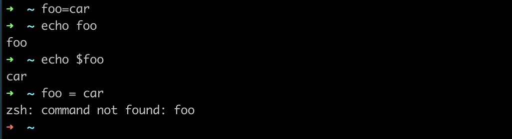

### foo=$\(pwd\)


### echo + string

" " vs ' ' : only same when define string

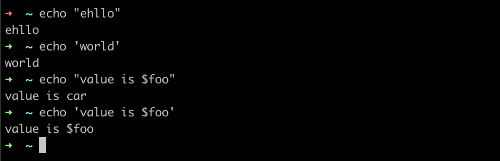

## define function

### vim mcd.sh

"vim mcd.sh" -&gt; "i" \(insert function\) -&gt; click "esc" -&gt; ":wq" \(write and quit\)

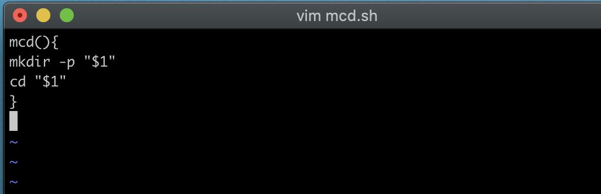

### source mcd.sh

execute in shell

### mcd test 

run the function\( create a "test" folder and enter it\) 

### $, !!


* `$0` - Name of the script
* `$1` to `$9` - Arguments to the script. `$1` is the first argument and so on.
* `$@` - All the arguments
* `$#` - Number of arguments
* `$?` - get the error code from the previous command, 0 means "no error", 1:" yes error
* `$$` - Process identification number \(PID\) for the current script
* `!!` - Entire last command, including arguments. A common pattern is to execute a command only for it to fail due to missing permissions; you can quickly re-execute the command with sudo by doing `sudo !!`
* `$_` - Last argument from the last command. If you are in an interactive shell, you can also quickly get this value by typing `Esc` followed by `.`

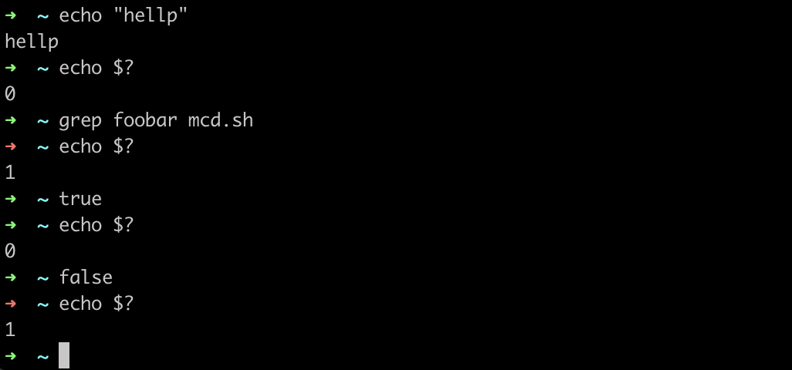

$\_: get the last argument of the previous command

!! : get the previous command

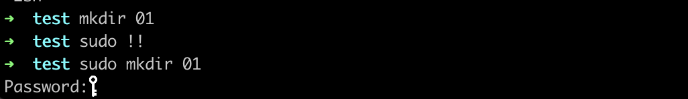

### \|\|, &&, ;

; next command

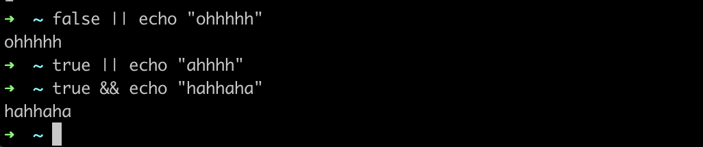


### $\(pwd\)


## `ls`

Read [`man ls`](https://www.man7.org/linux/man-pages/man1/ls.1.html) and write an `ls` command that lists files in the following manner

* Includes all files, including hidden files`: ls -a`
* Sizes are listed in human readable format \(e.g. 454M instead of 454279954\) : 

  ```text
  ls -lh
  ```

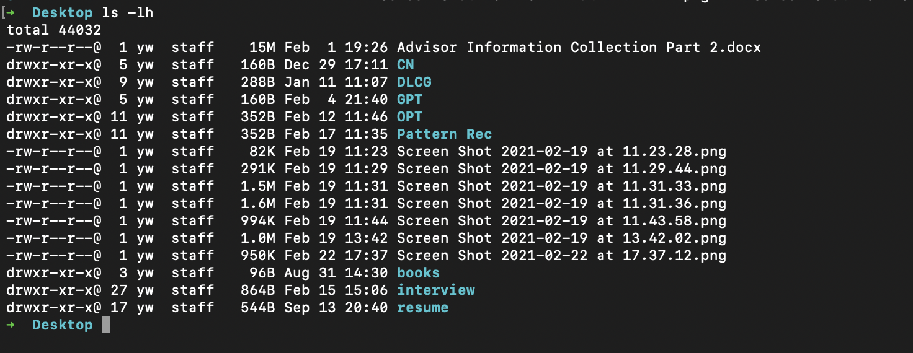

* Files are ordered by recency
* Output is colorized

#### ls \*.sh,   ls project?

\*: any character 

?: 1 character

### convert

convert image.png image.jpg

= convert image.{png,jpg}

### touch

create a file

### {}

to expand, press TAB


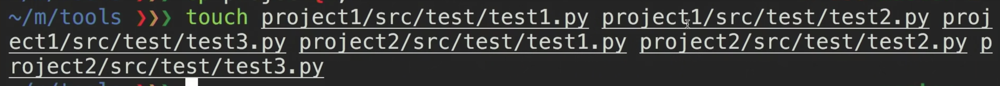

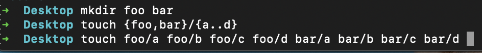

## `<(command)`

`<( CMD )` will execute `CMD` and place the output in a temporary file and substitute the `<()` with that file’s name.

### diff

check difference between 2 folders

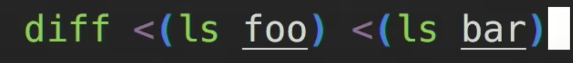

## bash script

### python

1. use "python" command

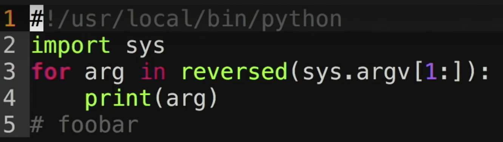


2. use "env" command

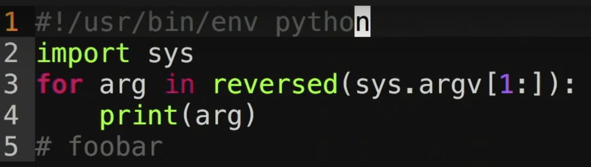


### shellcheck

check the code of .sh file

## find how to use command 

### `-h` or `--help` flags

### man

 [`man`](https://www.man7.org/linux/man-pages/man1/man.1.html) provides a manual page \(called manpage\) for a command you specify. For example, `man rm` will output the behavior of the `rm` command along with the flags that it takes

### tldr

tldr convert

tldr ffmpeg

tldr tar

## finding files

### find

```text
# Find all directories named src
find . -name src -type d
# Find all python files that have a folder named test in their path
find . -path '*/test/*.py' -type f
# Find all files modified in the last day
find . -mtime -1
# Find all zip files with size in range 500k to 10M
find . -size +500k -size -10M -name '*.tar.gz'
```

"." : current path

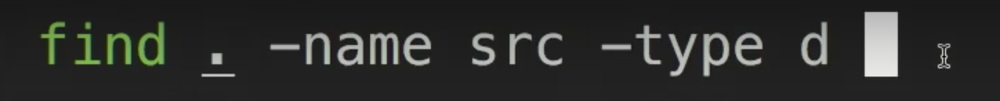


-mtime: find the modified time is last day

find and do sth.\(execute remove\)


```text
# Delete all files with .tmp extension
find . -name '*.tmp' -exec rm {} \;
# Find all PNG files and convert them to JPG
find . -name '*.png' -exec convert {} {}.jpg \;
```

other tool:

fd: ignore the gitfiles and color code, [`fd`](https://github.com/sharkdp/fd) is a simple, fast, and user-friendly alternative to `find`.

### locate, updatedb

create a db, faster

`locate` uses a database that is updated using [`updatedb`](https://www.man7.org/linux/man-pages/man1/updatedb.1.html). In most systems, `updatedb` is updated daily via [`cron`](https://www.man7.org/linux/man-pages/man8/cron.8.html)

## Finding code

### grep

`-C` for getting **C**ontext around the matching line 

`-v` for in**v**erting the match, i.e. print all lines that do **not** match the pattern. 

For example, `grep -C 5` will print 5 lines before and after the match. 


`-R` faster, since it will **R**ecursively go into directories and look for files for the matching string.  ignoring `.git` folders, using multi CPU support, &c

find the content "foobar"

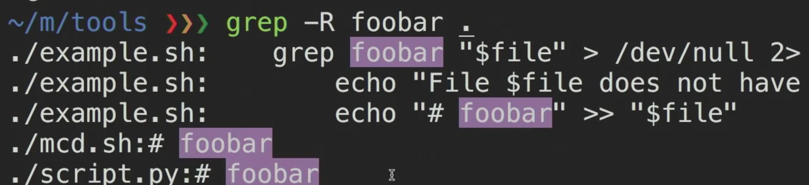

### faster tool: ripgrep\(rg\)

```bash
# Find all python files where I used the requests library
rg -t py 'import requests'
# Find all files (including hidden files) without a shebang line
rg -u --files-without-match "^#!"
# Find all matches of foo and print the following 5 lines
rg foo -A 5
# Print statistics of matches (# of matched lines and files )
rg --stats PATTERN
```

-t: type of file


-C: get  5 lines around it


-u: dont' ignore hidden files

--files without match that: the beginning of the line has a '\#' and '!'


others :

ack, ag, rg

## Finding shell commands

### history


`Ctrl+R` to perform backwards search through your history. After pressing `Ctrl+R`, you can type a substring you want to match for commands in your history. As you keep pressing it, you will cycle through the matches in your history. 

This can also be enabled with the UP/DOWN arrows in [zsh](https://github.com/zsh-users/zsh-history-substring-search).

### fzf

fuzzy matching

`fzf` is a general-purpose fuzzy finder that can be used with many commands. Here it is used to fuzzily match through your history and present results in a convenient and visually pleasing manner.

## other tools for dir searching

**ls -r**: recursively list

**tree**

**broot**

Another cool history-related trick I really enjoy is **history-based autosuggestions**. First introduced by the [fish](https://fishshell.com/) shell,

Finding frequent and/or recent files and directories can be done through tools like [`fasd`](https://github.com/clvv/fasd) and [`autojump`](https://github.com/wting/autojump). 

Fasd ranks files and directories by [_frecency_](https://developer.mozilla.org/en-US/docs/Mozilla/Tech/Places/Frecency_algorithm), that is, by both _frequency_ and _recency_. By default, `fasd` adds a `z` command that you can use to quickly `cd` using a substring of a _frecent_ directory. For example, if you often go t`/home/user/files/cool_project` you can simply use `z cool` to jump there. U

Using autojump, this same change of directory could be accomplished using `j cool`.

