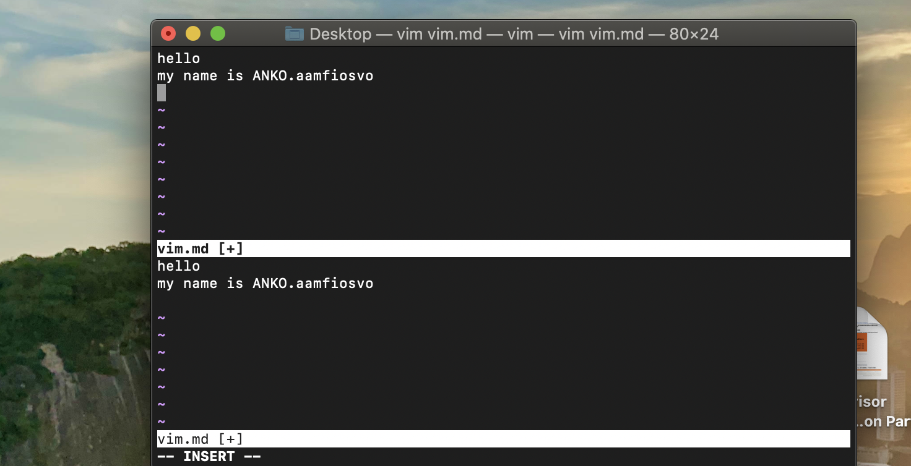

# L3. Editors \(Vim\)

## notation

Ctrl-V = ^V = &lt;C-V&gt;

## mode

* **Normal**: for moving around a file and making edits
* **Insert**: for inserting text
* **Replace**: for replacing text
* **Visual** \(plain, line, or block\): for selecting blocks of text
* **Command-line**: for running a command

You change modes by pressing `<ESC>` \(the escape key\) to switch from any mode back to Normal mode. 

From Normal mode,   
enter Insert mode with `i`,   
Replace mode with `R`,   
Visual mode with `v`, Visual Line mode with `V`, Visual Block mode with `<C-v>` \(Ctrl-V, sometimes also written `^V`\),   
and Command-line mode with `:`.

You use the `<ESC>` key a lot when using Vim: consider remapping Caps Lock to Escape \([macOS instructions](https://vim.fandom.com/wiki/Map_caps_lock_to_escape_in_macOS)\).

## Basics

### Inserting text

From Normal mode, press `i` to enter Insert mode. 

 press `<ESC>` to return to Normal mode. 


### Command-line

Command mode can be entered by typing `:` in Normal mode. 

* `:q` quit \(close the current window\)
* :qa quit all \(close all windows\)
* `:w` save \(“write”\)
* `:wq` save and quit
* `:e {name of file}` open file for editing
* `:ls` show open buffers
* `:help {topic}` open help
  * `:help :w` opens help for the `:w` command
  * `:help w` opens help for the `w` movement
* :sp create 2 different windows
* :tabnew: create new tab, each tab has some wins



## what can do **in normal mode**

Vim’s interface is a programming language

### Movement <a id="movement"></a>

* Basic movement: `hjkl` \(left, down, up, right\)
* Words: `w` \(next word\), `b` \(beginning of word\), `e` \(end of word\)
* Lines: `0` \(beginning of line\), `^` \(first non-blank character\), `$` \(end of line\)
* Screen: `H` \(top of screen\), `M` \(middle of screen\), `L` \(bottom of screen\)
* Scroll: `Ctrl-u` \(up\), `Ctrl-d` \(down\)
* File: `gg` \(beginning of file\), `G` \(end of file\)
* Line numbers: `:{number}<CR>` or `{number}G` \(line {number}\)
* Misc: `%` \(corresponding item\)
* Find: `f{character}`, `t{character}`, `F{character}`, `T{character}`
  * find/to forward/backward {character} on the current line
  * `,` / `;` for navigating matches
* Search: `/{regex}`, `n` / `N` for navigating matches, press n/N to jump to next/front

### Selection <a id="selection"></a>

Visual modes:

* Visual: `v`
* Visual Line: `V`
* Visual Block: `Ctrl-v`

Can use movement keys to make selection.

### Edits <a id="edits"></a>

* `i` enter Insert mode
  * but for manipulating/deleting text, want to use something more than backspace
* `o` / `O` insert line below / above
* a is append insert
* `d{motion}` delete {motion}
  * e.g. `dw` is delete word, `d$` is delete to end of line, `d0` is delete to beginning of line, de is delete the end of the word
* `c{motion}` change {motion}
  * e.g. `cw` is change word, ce is change to the end of the word
  * like `d{motion}` followed by `i`
* `dd: delete the line; cc: delete the line and insert`
* `x` delete character \(equal do `dl`\)
*  r{character} replace to this character e.g. ra is replace to a
* `s` substitute character \(equal to `xi`\)
* Visual mode + manipulation
  * select text, `d` to delete it or `c` to change it, `y` to copy it
* `u` to undo, `<C-r>` to redo
* `y` to copy / “yank” \(some other commands like `d` also copy\)
  * yy : copy the current line
  * yw: copy the word
* `p` to paste
* . to repeat the previous command
* Lots more to learn: e.g. `~` flips the case of a character


### Counts <a id="counts"></a>

You can combine nouns and verbs with a count, which will perform a given action a number of times.\( select n words/lines in visual mode\)

* `3w` move 3 words forward
* `5j` move 5 lines down
* `7dw` delete 7 words

use the line number to count


### Modifiers <a id="modifiers"></a>

`i`, which means “inner” or “inside”, 

`a`, which means “around” or 'incluidng"

* `ci(` change the contents inside the current pair of parentheses
* `ci[` change the contents inside the current pair of square brackets
* di \[ or di\( is delete
* % jump between \[ \], \(\)
* da\[ , da\( is delete whole contents include \[\], \(\)
* `da'` delete a single-quoted string, including the surrounding single quotes

## Customizing Vim

Vim is customized through a plain-text configuration file in `~/.vimrc`

## Extending Vim <a id="extending-vim"></a>

Simply create the directory `~/.vim/pack/vendor/start/`, and put plugins in there \(e.g. via `git clone`\).

Here are some of our favorite plugins:

* [ctrlp.vim](https://github.com/ctrlpvim/ctrlp.vim): fuzzy file finder
* [ack.vim](https://github.com/mileszs/ack.vim): code search
* [nerdtree](https://github.com/scrooloose/nerdtree): file explorer
* [vim-easymotion](https://github.com/easymotion/vim-easymotion): magic motions

We’re trying to avoid giving an overwhelmingly long list of plugins here. You can check out the instructors’ dotfiles \([Anish](https://github.com/anishathalye/dotfiles), [Jon](https://github.com/jonhoo/configs), [Jose](https://github.com/JJGO/dotfiles)\) to see what other plugins we use. Check out [Vim Awesome](https://vimawesome.com/) for more awesome Vim plugins. There are also tons of blog posts on this topic: just search for “best Vim plugins”.

## Vim-mode in other programs <a id="vim-mode-in-other-programs"></a>

Many tools support Vim emulation. The quality varies from good to great; depending on the tool, it may not support the fancier Vim features, but most cover the basics pretty well.

### Shell <a id="shell"></a>

If you’re a Bash user, use `set -o vi`. If you use Zsh, `bindkey -v`. For Fish, `fish_vi_key_bindings`. Additionally, no matter what shell you use, you can `export EDITOR=vim`. This is the environment variable used to decide which editor is launched when a program wants to start an editor. For example, `git` will use this editor for commit messages.

### Readline <a id="readline"></a>

Many programs use the [GNU Readline](https://tiswww.case.edu/php/chet/readline/rltop.html) library for their command-line interface. Readline supports \(basic\) Vim emulation too, which can be enabled by adding the following line to the `~/.inputrc` file:

```text
set editing-mode vi
```

With this setting, for example, the Python REPL will support Vim bindings.

### Others <a id="others"></a>

There are even vim keybinding extensions for web [browsers](http://vim.wikia.com/wiki/Vim_key_bindings_for_web_browsers) - some popular ones are [Vimium](https://chrome.google.com/webstore/detail/vimium/dbepggeogbaibhgnhhndojpepiihcmeb?hl=en) for Google Chrome and [Tridactyl](https://github.com/tridactyl/tridactyl) for Firefox. You can even get Vim bindings in [Jupyter notebooks](https://github.com/lambdalisue/jupyter-vim-binding).


## Advanced Vim <a id="advanced-vim"></a>

Here are a few examples to show you the power of the editor. We can’t teach you all of these kinds of things, but you’ll learn them as you go. A good heuristic: whenever you’re using your editor and you think “there must be a better way of doing this”, there probably is: look it up online.

### Search and replace <a id="search-and-replace"></a>

`:s` \(substitute\) command \([documentation](http://vim.wikia.com/wiki/Search_and_replace)\).

* `%s/foo/bar/g`
  * replace foo with bar globally in file
* `%s/\[.*\](\(.*\))/\1/g`
  * replace named Markdown links with plain URLs


### Multiple windows <a id="multiple-windows"></a>

* `:sp` / `:vsp` to split windows
* Can have multiple views of the same buffer.

### Macros <a id="macros"></a>

* `q{character}` to start recording a macro in register `{character}`
* `q` to stop recording
* `@{character}` replays the macro
* Macro execution stops on error
* `{number}@{character}` executes a macro {number} times
* Macros can be recursive
  * first clear the macro with `q{character}q`
  * record the macro, with `@{character}` to invoke the macro recursively \(will be a no-op until recording is complete\)
* Example: convert xml to json \([file](https://missing.csail.mit.edu/2020/files/example-data.xml)\)
  * Array of objects with keys “name” / “email”
  * Use a Python program?
  * Use sed / regexes
    * `g/people/d`
    * `%s/<person>/{/g`
    * `%s/<name>\(.*\)<\/name>/"name": "\1",/g`
    * …
  * Vim commands / macros
    * `Gdd`, `ggdd` delete first and last lines
    * Macro to format a single element \(register `e`\)
      * Go to line with `<name>`
      * `qe^r"f>s": "<ESC>f<C"<ESC>q`
    * Macro to format a person
      * Go to line with `<person>`
      * `qpS{<ESC>j@eA,<ESC>j@ejS},<ESC>q`
    * Macro to format a person and go to the next person
      * Go to line with `<person>`
      * `qq@pjq`
    * Execute macro until end of file
      * `999@q`
    * Manually remove last `,` and add `[` and `]` delimiters

## Resources <a id="resources"></a>

* `vimtutor` is a tutorial that comes installed with Vim - if Vim is installed, you should be able to run `vimtutor` from your shell
* [Vim Adventures](https://vim-adventures.com/) is a game to learn Vim
* [Vim Tips Wiki](http://vim.wikia.com/wiki/Vim_Tips_Wiki)
* [Vim Advent Calendar](https://vimways.org/2019/) has various Vim tips
* [Vim Golf](http://www.vimgolf.com/) is [code golf](https://en.wikipedia.org/wiki/Code_golf), but where the programming language is Vim’s UI
* [Vi/Vim Stack Exchange](https://vi.stackexchange.com/)
* [Vim Screencasts](http://vimcasts.org/)
* [Practical Vim](https://pragprog.com/titles/dnvim2/) \(book\)


## Exercises <a id="exercises"></a>

## Install and configure a plugin: [ctrlp.vim](https://github.com/ctrlpvim/ctrlp.vim).

1. Create the plugins directory with `mkdir -p ~/.vim/pack/vendor/start`
2. Download the plugin: `cd ~/.vim/pack/vendor/start; git clone https://github.com/ctrlpvim/ctrlp.vim`
3. Read the [documentation](https://github.com/ctrlpvim/ctrlp.vim/blob/master/readme.md) for the plugin. Try using CtrlP to locate a file by navigating to a project directory, opening Vim, and using the Vim command-line to start `:CtrlP`.
4. Customize CtrlP by adding [configuration](https://github.com/ctrlpvim/ctrlp.vim/blob/master/readme.md#basic-options) to your `~/.vimrc` to open CtrlP by pressing Ctrl-P.

### Basic Usage

* Run `:CtrlP` or `:CtrlP [starting-directory]` to invoke CtrlP in find file mode.
* Run `:CtrlPBuffer` or `:CtrlPMRU` to invoke CtrlP in find buffer or find MRU file mode.
* Run `:CtrlPMixed` to search in Files, Buffers and MRU files at the same time.

Check `:help ctrlp-commands` and `:help ctrlp-extensions` for other commands.

**Once CtrlP is open:**

* Press `<F5>` to purge the cache for the current directory to get new files, remove deleted files and apply new ignore options.
* Press `<c-f>` and `<c-b>` to cycle between modes.
* Press `<c-d>` to switch to filename only search instead of full path.
* Press `<c-r>` to switch to regexp mode.
* Use `<c-j>`, `<c-k>` or the arrow keys to navigate the result list.
* Use `<c-t>` or `<c-v>`, `<c-x>` to open the selected entry in a new tab or in a new split.
* Use `<c-n>`, `<c-p>` to select the next/previous string in the prompt's history.
* Use `<c-y>` to create a new file and its parent directories.
* Use `<c-z>` to mark/unmark multiple files and `<c-o>` to open them.

Run `:help ctrlp-mappings` or submit `?` in CtrlP for more mapping help.

* Submit two or more dots `..` to go up the directory tree by one or multiple levels.
* End the input string with a colon `:` followed by a command to execute it on the opening file\(s\): Use `:25` to jump to line 25. Use `:diffthis` when opening multiple files to run `:diffthis` on the first 4 files.

## 

## 

