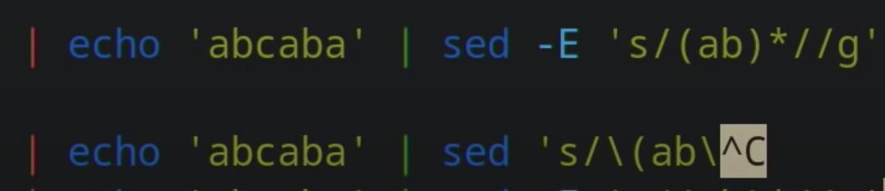
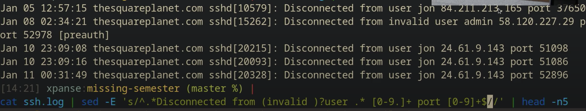

# L4. Data Wrangling


log into my server by looking at my server’s log:

```text
ssh myserver journalctl
```


That’s far too much stuff. Let’s limit it to ssh stuff:

```text
ssh myserver journalctl | grep sshd
```


```text
$ ssh myserver 'journalctl | grep sshd | grep "Disconnected from"' > ssh.log
$ less ssh.log
```

## `sed` : substitution

The `s` command is written on the form: `s/REGEX/SUBSTITUTION/`, where `REGEX` is the regular expression you want to search for, and `SUBSTITUTION` is the text you want to substitute matching text with.

```text
 | sed 's/.*Disconnected from //'
```

### Regular expressions <a id="regular-expressions"></a>

* `.` means “any single character” except newline
* `*` zero or more of the preceding match
* `+` one or more of the preceding match
* `[abc]` any one character of `a`, `b`, and `c`
* `(RX1|RX2)` either something that matches `RX1` or `RX2`
* `^` the start of the line
* `$` the end of the line

`sed`’s regular expressions are somewhat weird, and will require you to put a `\` before most of these to give them their special meaning. Or you can pass `-E`.

replace once --&gt; ba


-g: replace all --&gt;  ' '


replace the string 'ab' --&gt;ca




### problem!

What if someone tried to log in with the username “Disconnected from”? We’d have:

```text
Jan 17 03:13:00 thesquareplanet.com sshd[2631]: Disconnected from invalid user Disconnected from 46.97.239.16 port 55920 [preauth]
```

What would we end up with? Well, `*` and `+` are, by default, “greedy”. They will match as much text as they can. So, in the above, we’d end up with just

```text
46.97.239.16 port 55920 [preauth]
```



In some regular expression implementations, you can just suffix `*` or `+` with a `?` to make them non-greedy, but sadly `sed` doesn’t support that. We _could_ switch to perl’s command-line mode though, which _does_ support that construct:

```text
perl -pe 's/.*?Disconnected from //'
```

`sed` can do all sorts of other interesting things, like injecting text \(with the `i` command\), explicitly printing lines \(with the `p` command\), selecting lines by index, and lots of other things. Check `man sed`

### `other tools`

```text
 | sort | uniq -c
```

### `sort` 

`sort -n` will sort in numeric \(instead of lexicographic\) order. 

`-k1,1` means “sort by only the first whitespace-separated column”. The `,n` part says “sort until the `n`th field, where the default is the end of the line

```text
sort -nk1,1 | tail -n10
```

`sort -r`, which sorts in reverse order.

### tail, head

If we wanted the _least_ common ones, we could use `head` instead of `tail`.

### `uniq -c` 

`print only once even if it's duplicate`

```text
 | awk '{print $2}' | paste -sd,
```

### `paste`

`paste`: it lets you combine single lines \(`-s`\) by a given single-character delimiter \(`-d`; 

### awk – another editor <a id="awk--another-editor"></a>

`$0` is set to the entire line’s contents, and `$1` through `$n` are set to the `n`th _field_ of that line, when separated by the `awk` field separator \(whitespace by default, change with `-F`\).

Let’s compute the number of single-use usernames that start with `c` and end with `e`:

```text
 | awk '$1 == 1 && $2 ~ /^c[^ ]*e$/ { print $2 }' | wc -l

```

### wc -l

The pattern says that the first field of the line should be equal to 1 \(that’s the count from `uniq -c`\), and that the second field should match the given regular expression. And the block just says to print the username. 

We then count the number of lines in the output with `wc -l`.

However, `awk` is a programming language, remember?

```text
BEGIN { rows = 0 }
$1 == 1 && $2 ~ /^c[^ ]*e$/ { rows += $1 }
END { print rows }
```

`BEGIN` is a pattern that matches the start of the input \(and `END` matches the end\). Now, the per-line block just adds the count from the first field \(although it’ll always be 1 in this case\), and then we print it out at the end. In fact, we _could_ get rid of `grep` and `sed` entirely, because `awk` [can do it all](https://backreference.org/2010/02/10/idiomatic-awk/), but we’ll leave that as an exercise to the reader.

## Analyzing data

### bc: berkeley calculator

a calculator that can read from STDIN! For example, add the numbers on each line together by concatenating them together, delimited by `+`:

```text
 | paste -sd+ | bc -l
```

```text
echo "2*($(data | paste -sd+))" | bc -l
```

### [R](https://www.r-project.org/)

R is another \(weird\) programming language that’s great at data analysis and [plotting](https://ggplot2.tidyverse.org/)

```text
| awk '{print $1}' | R --slave -e 'x <- scan(file="stdin", quiet=TRUE); summary(x)'
```

### `gnuplot`

If you just want some simple plotting, `gnuplot` is your friend

## Data wrangling to make arguments

### `xargs`

`set one line as arguments`

Sometimes you want to do data wrangling to find things to install or remove based on some longer list. The data wrangling we’ve talked about so far + `xargs` can be a powerful combo.

For example, as seen in lecture, I can use the following command to uninstall old nightly builds of Rust from my system by extracting the old build names using data wrangling tools and then passing them via `xargs` to the uninstaller:

```text
rustup toolchain list | grep nightly | grep -vE "nightly-x86" | sed 's/-x86.*//' | xargs rustup toolchain uninstall
```

## Wrangling binary data

### ffmpeg

So far, we have mostly talked about wrangling textual data, but pipes are just as useful for binary data. For example, we can use ffmpeg to capture an image from our camera, convert it to grayscale, compress it, send it to a remote machine over SSH, decompress it there, make a copy, and then display it.

```text
ffmpeg -loglevel panic -i /dev/video0 -frames 1 -f image2 -
 | convert - -colorspace gray -
 | gzip
 | ssh mymachine 'gzip -d | tee copy.jpg | env DISPLAY=:0 feh -'
```


## Exercises <a id="exercises"></a>

1. Take this [short interactive regex tutorial](https://regexone.com/).

