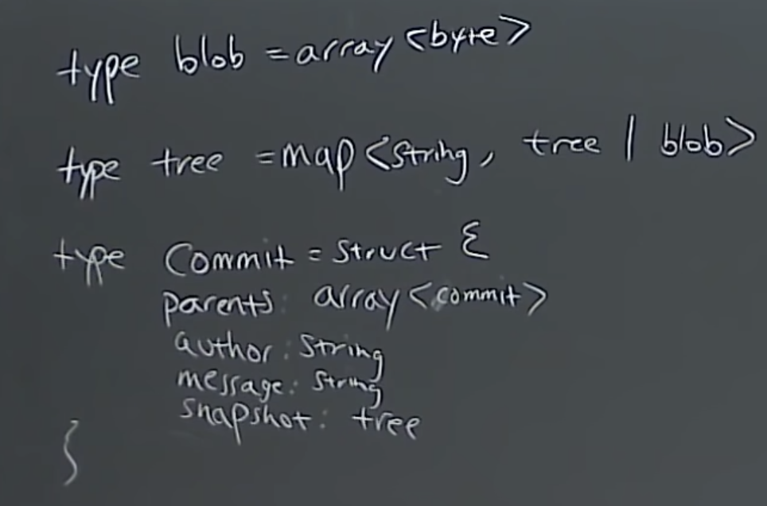
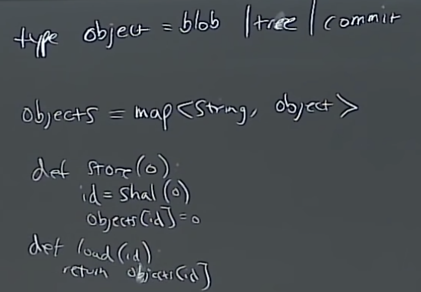

# L6. Version Control \(Git\)

## Git’s data model



It’s a clean, simple model of history.

```text
// a file is a bunch of bytes
type blob = array<byte>

// a directory contains named files and directories
type tree = map<string, tree | blob>

// a commit has parents, metadata, and the top-level tree
type commit = struct {
    parent: array<commit>
    author: string
    message: string
    snapshot: tree
}
```


### Objects and content-addressing <a id="objects-and-content-addressing"></a>



An “object” is a blob, tree, or commit:

```text
type object = blob | tree | commit
```

In Git data store, all objects are content-addressed by their [SHA-1 hash](https://en.wikipedia.org/wiki/SHA-1).

```text
objects = map<string, object>

def store(object):
    id = sha1(object)
    objects[id] = object

def load(id):
    return objects[id]
```

Blobs, trees, and commits are unified in this way: they are all objects. When they reference other objects, they don’t actually _contain_ them in their on-disk representation, but have a reference to them by their hash.

### References <a id="references"></a>

Now, all snapshots can be identified by their SHA-1 hash. That’s inconvenient, because humans aren’t good at remembering strings of 40 hexadecimal characters.

Git’s solution to this problem is human-readable names for SHA-1 hashes, called “references”.

References are pointers to commits. Unlike objects, which are immutable, references are mutable \(can be updated to point to a new commit\). For example, the `master` reference usually points to the latest commit in the main branch of development.

```text
references = map<string, string>

def update_reference(name, id):
    references[name] = id

def read_reference(name):
    return references[name]

def load_reference(name_or_id):
    if name_or_id in references:
        return load(references[name_or_id])
    else:
        return load(name_or_id)
```

### Repositories <a id="repositories"></a>

Finally, we can define what \(roughly\) is a Git _repository_: it is the data `objects` and `references`.


## Git command-line interface <a id="git-command-line-interface"></a>


To avoid duplicating information, we’re not going to explain the commands below in detail. See the highly recommended [Pro Git](https://git-scm.com/book/en/v2) for more information, or watch the lecture video.

### Basics <a id="basics"></a>

* `git help <command>`: get help for a git command
* `git init`: creates a new git repo, with data stored in the `.git` directory
* `git status`: tells you what’s going on
* `git add <filename>`: adds files to staging area
* `git commit`: creates a new commit
* `git commit -m 'content'`: creates a new commit, short edit
* Write [good commit messages](https://tbaggery.com/2008/04/19/a-note-about-git-commit-messages.html)!
* Even more reasons to write [good commit messages](https://chris.beams.io/posts/git-commit/)!
* `git log`: shows a flattened log of history
* **`git log --all --graph --decorate`**: visualizes history as a DAG
* **`git log --all --graph --decorate --oneline`**: more compact, visualizes history as a DAG
* `git diff <filename>`: show changes you made relative to the staging area
* `git diff <revision> <filename>`: shows differences in a file between snapshots and current local version
* `git diff <revision1> <revision2> <filename>`: shows differences in a file between snapshots
* `git checkout <revision>`: updates HEAD and current branch


### Branching and merging <a id="branching-and-merging"></a>

* `git branch`: shows branches
* `git branch <name>`: creates a branch
* `git checkout -b <name>`: creates a branch and switches to it
  * same as `git branch <name>; git checkout <name>`
* `git merge <revision>`: merges into current branch
* `git mergetool`: use a fancy tool to help resolve merge conflicts
* git merge --continue: after solve the conflicts manually, continue to merge-&gt;git add
* `git rebase`: rebase set of patches onto a new base

### Remotes <a id="remotes"></a>

* `git remote`: list remotes
* `git remote add <name> <url>`: add a remote
* `git push <remote> <local branch>:<remote branch>`: send objects to remote, and update remote reference
* `git branch --set-upstream-to=<remote>/<remote branch>`: set up correspondence between local and remote branch
* `git fetch`: retrieve objects/references from a remote
* `git pull`: same as `git fetch; git merge`
* `git clone <url> <folder name>`: download repository from remote to folder name

### Undo <a id="undo"></a>

* `git commit --amend`: edit a commit’s contents/message
* `git reset HEAD <file>`: unstage a file
* `git checkout -- <file>`: discard changes

## Advanced Git <a id="advanced-git"></a>

* `git config`: Git is [highly customizable](https://git-scm.com/docs/git-config)
* `git clone --depth=1 or git clone --shallow`: shallow clone, without entire version history
* `git add -p`: interactive staging
* git diff --cashed: actual diff that want to commit 
* `git rebase -i`: interactive rebasing
* `git blame`: show who last edited which line
* git show: get information from that particular commit
* `git stash`: temporarily remove modifications to working directory -&gt; git stash pop: return back
* `git bisect`: binary search history \(e.g. for regressions\)
* `.gitignore`: [specify](https://git-scm.com/docs/gitignore) intentionally untracked files to ignore


## Miscellaneous <a id="miscellaneous"></a>

* **Shell integration**: it’s super handy to have a Git status as part of your shell prompt \([zsh](https://github.com/olivierverdier/zsh-git-prompt), [bash](https://github.com/magicmonty/bash-git-prompt)\). Often included in frameworks like [Oh My Zsh](https://github.com/ohmyzsh/ohmyzsh).
* **Editor integration**: similarly to the above, handy integrations with many features. [fugitive.vim](https://github.com/tpope/vim-fugitive) is the standard one for Vim.
* **Workflows**: we taught you the data model, plus some basic commands; we didn’t tell you what practices to follow when working on big projects \(and there are [many](https://nvie.com/posts/a-successful-git-branching-model/) [different](https://www.endoflineblog.com/gitflow-considered-harmful) [approaches](https://www.atlassian.com/git/tutorials/comparing-workflows/gitflow-workflow)\).
* **GitHub**: Git is not GitHub. GitHub has a specific way of contributing code to other projects, called [pull requests](https://help.github.com/en/github/collaborating-with-issues-and-pull-requests/about-pull-requests).
* **Other Git providers**: GitHub is not special: there are many Git repository hosts, like [GitLab](https://about.gitlab.com/) and [BitBucket](https://bitbucket.org/).


## Resources <a id="resources"></a>

* [Pro Git](https://git-scm.com/book/en/v2) is **highly recommended reading**. Going through Chapters 1–5 should teach you most of what you need to use Git proficiently, now that you understand the data model. The later chapters have some interesting, advanced material.
* [Oh Shit, Git!?!](https://ohshitgit.com/) is a short guide on how to recover from some common Git mistakes.
* [Git for Computer Scientists](https://eagain.net/articles/git-for-computer-scientists/) is a short explanation of Git’s data model, with less pseudocode and more fancy diagrams than these lecture notes.
* [Git from the Bottom Up](https://jwiegley.github.io/git-from-the-bottom-up/) is a detailed explanation of Git’s implementation details beyond just the data model, for the curious.
* [How to explain git in simple words](https://smusamashah.github.io/blog/2017/10/14/explain-git-in-simple-words)
* [Learn Git Branching](https://learngitbranching.js.org/) is a browser-based game that teaches you Git.

