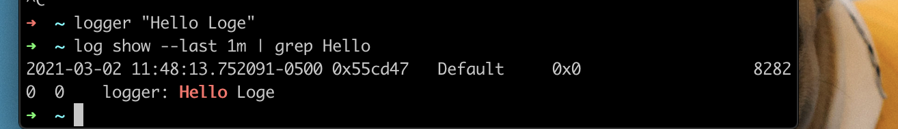

# L7. Debugging and Profiling

## Debugging <a id="debugging"></a>

### Printf debugging and Logging <a id="printf-debugging-and-logging"></a>

Logging is better than regular print statements for several reasons:

* You can log to files, sockets or even remote servers instead of standard output.
* Logging supports severity levels \(such as INFO, DEBUG, WARN, ERROR, &c\), that allow you to filter the output accordingly.
* For new issues, there’s a fair chance that your logs will contain enough information to detect what is going wrong.


[Here](https://missing.csail.mit.edu/static/files/logger.py) is an example code that logs messages:

```bash
$ python logger.py
# Raw output as with just prints
$ python logger.py log
# Log formatted output
$ python logger.py log ERROR
# Print only ERROR levels and above
$ python logger.py color
# Color formatted output
```

#### color code them

how does it do it? Programs like `ls` or `grep` are using [ANSI escape codes](https://en.wikipedia.org/wiki/ANSI_escape_code), which are special sequences of characters to indicate your shell to change the color of the output. 

For example, executing `echo -e "\e[38;2;255;0;0mThis is red\e[0m"` prints the message `This is red` in red on your terminal, as long as it supports [true color](https://gist.github.com/XVilka/8346728#terminals--true-color). If your terminal doesn’t support this \(e.g. macOS’s Terminal.app\), you can use the more universally supported escape codes for 16 color choices, for example `echo -e "\e[31;1mThis is red\e[0m"`.


### Third party logs <a id="third-party-logs"></a>

on macOS there is still `/var/log/system.log` but an increasing number of tools use the system log, that can be displayed with [`log show`](https://www.manpagez.com/man/1/log/). 

You can use data wrangling in "-log show"

For logging under the system logs you can use the [`logger`](https://www.man7.org/linux/man-pages/man1/logger.1.html) shell program. 

Here’s an example of using `logger` and how to check that the entry made it to the system logs. Moreover, most programming languages have bindings logging to the system log.

```text
logger "Hello Logs"
# On macOS
log show --last 1m | grep Hello
```



There are also some tools like [`lnav`](http://lnav.org/), that provide an improved presentation and navigation for log files.

### Debuggers <a id="debuggers"></a>

Many programming languages come with some form of debugger. In Python this is the Python Debugger [`pdb`](https://docs.python.org/3/library/pdb.html).

Here is a brief description of some of the commands `pdb` supports:

* **l**\(ist\) - Displays 11 lines around the current line or continue the previous listing.
* **s**\(tep\) - Execute the current line, stop at the first possible occasion.
* **n**\(ext\) - Continue execution until the next line in the current function is reached or it returns.
* **b**\(reak\) - Set a breakpoint \(depending on the argument provided\).
* **p**\(rint\) - Evaluate the expression in the current context and print its value. There’s also **pp** to display using [`pprint`](https://docs.python.org/3/library/pprint.html) instead.
* **r**\(eturn\) - Continue execution until the current function returns.
* **q**\(uit\) - Quit the debugger.

 [`ipdb`](https://pypi.org/project/ipdb/) is an improved `pdb` that uses the [`IPython`](https://ipython.org/) REPL enabling tab completion, syntax highlighting, better tracebacks, and better introspection while retaining the same interface as the `pdb` module.

For more low level programming you will probably want to look into [`gdb`](https://www.gnu.org/software/gdb/) \(and its quality of life modification [`pwndbg`](https://github.com/pwndbg/pwndbg)\) and [`lldb`](https://lldb.llvm.org/). They are optimized for C-like language debugging but will let you probe pretty much any process and get its current machine state: registers, stack, program counter, &c.

